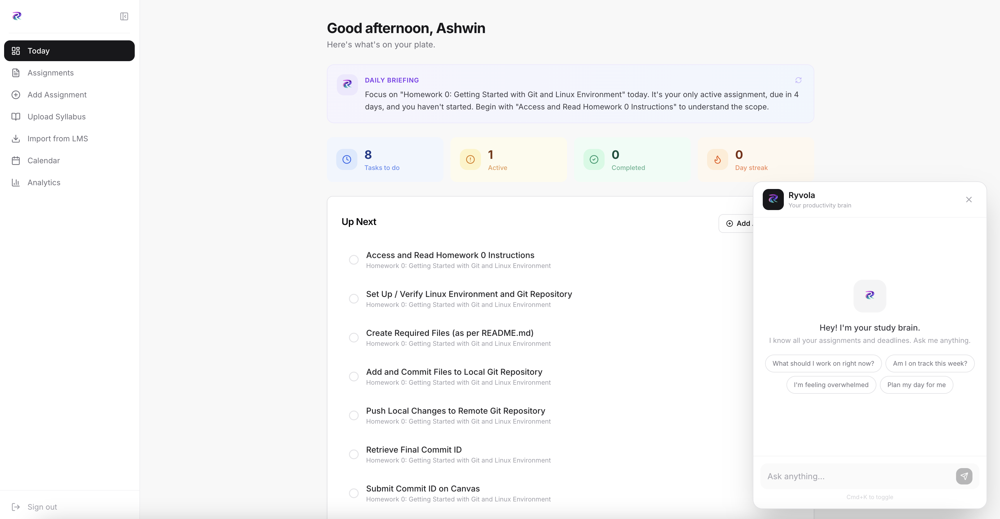

# Ryvola: your AI productivity brain



## Setup

### 1. Supabase

1. Go to [supabase.com](https://supabase.com) and create a project.
2. **Settings** → **API** → copy **Project URL** and **anon public** key.
3. Enable Google sign-in: **Authentication** → **Providers** → **Google** → turn on. Use the same OAuth client from Google Cloud (step 3 below).
4. Run the schema: **SQL Editor** → paste `supabase/schema.sql` → Run.
5. Run migrations: `supabase/migrations/001_standalone-tasks.sql`, `002_time-tracking.sql`, `003_shared-plans.sql`.
6. **Storage** → create bucket `assignments` (public if you want images to load).

### 2. Google AI Studio (Gemini)

1. Go to [aistudio.google.com](https://aistudio.google.com).
2. Create or select a project.
3. **Get API key** → copy for `GEMINI_API_KEY`.

### 3. Google Cloud (Calendar OAuth)

1. Go to [console.cloud.google.com](https://console.cloud.google.com).
2. Create a project.
3. **APIs & Services** → **Enable APIs** → enable **Google Calendar API**.
4. **Credentials** → **Create credentials** → **OAuth client ID**.
5. If needed: **OAuth consent screen** → External → add app name and email.
6. Create OAuth client: type **Web application**, add redirect URI: `http://localhost:3000/api/calendar/callback` (and your production URL if you deploy).
7. Copy **Client ID** and **Client secret**.
8. Use the same Client ID and secret in Supabase → Authentication → Providers → Google.

### 4. Environment variables

```bash
cp .env.example .env.local
```
   Edit `.env.local`:
   | Variable | Where |
   |----------|-------|
   | `NEXT_PUBLIC_SUPABASE_URL` | Supabase Settings → API |
   | `NEXT_PUBLIC_SUPABASE_ANON_KEY` | Supabase Settings → API |
   | `GEMINI_API_KEY` | Google AI Studio |
   | `GOOGLE_CLIENT_ID` | Google Cloud Credentials |
   | `GOOGLE_CLIENT_SECRET` | Google Cloud Credentials |

### 5. Run

```bash
pnpm install
pnpm dev
```

Open [http://localhost:3000](http://localhost:3000). Sign in with Google, then connect Calendar from the app.

## Stack

- Next.js 14 (App Router), TypeScript, Tailwind
- Supabase (auth, DB, storage)
- Gemini (assignment parsing, chat)
- Google Calendar API
